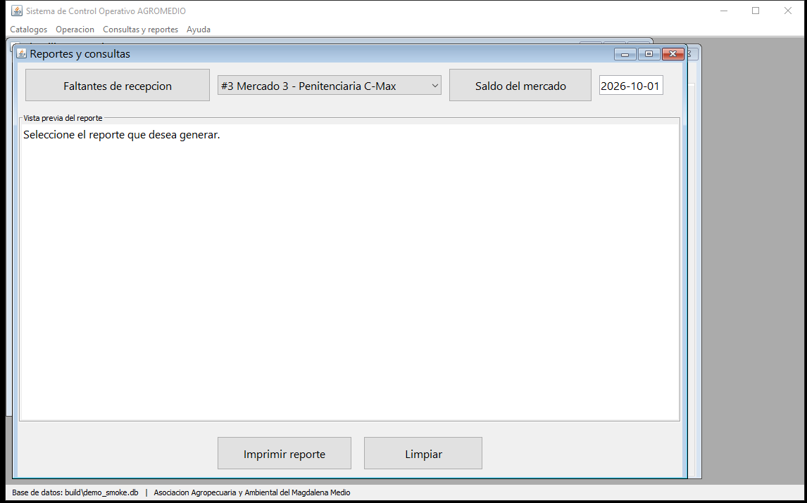

# INFORME TÉCNICO PROYECTO INTEGRADOR

## Sistema de Control Operativo AGROMEDIO

**Modalidad:** Proyecto integrador

**Título del informe:** Elaboración de un sistema de control operativo para el fortalecimiento del manejo de la operación en la empresa Agromedio del sector de la manipulación y distribución de alimentos

| Campo | Datos |
|---|---|
| Alumnos | Santiago Colmenares Parra, CC. 1.098.680.530, santiagocolmenares@uts.edu.co, 316-1252116 |
| | Califa Hernández Iván Mauricio, CC. 1.127.339.240, icalifa@uts.edu.co, 302-6065830 |
| | Jorge Andrés Correa Morales, CC. 1.097.101.052, jorgeandrescorrea12@gmail.com, 317-5712960 |
| Tutores / docentes | Elsa Patricia Carvajal Valero, Laura Cristina Duarte Quintero, Carlos Adolfo Beltran Castro |
| Institución | Unidades Tecnológicas de Santander – Facultad de Ciencias Naturales e Ingenierías |
| Programa | Tecnología en Desarrollo de Sistemas Informáticos |
| Materias | 1750-213806-B191-TSI304 Planeación de Sistemas Informáticos · 1750-213848-D191-TSI301 Motores de Bases de Datos · 1750-213807-B191-TSI302 Programación Orientada a Objetos |
| Cliente | Asociación Agropecuaria y Ambiental del Magdalena Medio – Agromedio |
| Fecha | Bucaramanga, Santander, 12 de septiembre de 2026 |

---

## RESUMEN EJECUTIVO

La empresa Agromedio recibe a diario instrucciones de producción en archivos de hoja de cálculo que la administración envía sin estructura uniforme, y ejecuta después cuatro etapas operativas —compras, recepción, alistamiento y despacho— con control manual, lo que provoca faltantes de mercancía, sobrecostos y reclamos por mercados incompletos. Este proyecto desarrolló un sistema de información de escritorio que automatiza el ciclo completo de la operación: carga de instrucciones desde archivos `.xlsx`, consolidación automática de compras, registro de recepción con cálculo explícito de faltantes, control del avance de alistamiento y verificación paso a paso del despacho por mercado. La solución se implementó en Java sobre una arquitectura multicapa de presentación, lógica de negocio y acceso a datos, con interfaz gráfica Swing, persistencia en base de datos SQLite con integridad referencial, disparadores y vistas, y lectura de hojas de cálculo mediante Apache POI. La verificación se realizó con suites automatizadas que validan la base de datos, los diez requerimientos funcionales y la construcción de las trece ventanas del sistema, obteniendo resultados satisfactorios en la totalidad de las pruebas. Como resultado, la organización dispone de un prototipo funcional que traza cada cantidad solicitada desde la instrucción original hasta la entrega verificada, eliminando la sumatoria manual y garantizando que ningún mercado salga sin el cien por ciento de sus ítems confirmados.

**PALABRAS CLAVE:** sistema operativo, control de operaciones, base de datos, aplicación de escritorio, trazabilidad.

---

## INTRODUCCIÓN

La gestión de operaciones en empresas que distribuyen alimentos a comedores escolares, instituciones del orden público y entidades gubernamentales depende hoy de información que circula en formatos no estructurados. Cuando la consolidación de órdenes, la verificación de entregas y el armado de mercados se realizan manualmente, cualquier diferencia entre lo solicitado, lo comprado y lo recibido se traslada al cliente final en forma de faltantes. Este documento presenta el diseño, la implementación y la verificación de un sistema de control operativo para Agromedio que automatiza el ciclo que va desde la instrucción administrativa hasta el despacho verificado.

El trabajo se enmarca en las tres materias del programa que lo avalan: la planeación de sistemas informáticos aporta el levantamiento de requisitos, la trazabilidad de requerimientos y la documentación de entrega; los motores de bases de datos aportan el modelo de datos, la integridad y las consultas de soporte a la decisión; y la programación orientada a objetos aporta la arquitectura multicapa y el diseño de componentes reutilizables. La adopción de SQLite como motor de persistencia —frente a la opción PostgreSQL o MySQL planteadas inicialmente— responde a la naturaleza de prototipo de escritorio de una sola sede: elimina la instalación y administración de un servidor, mantiene la integridad referencial y las transacciones mediante un único archivo portátil, y conserva la posibilidad de migrar el modelo a un servidor posteriormente sin alterar la lógica de negocio.

El método empleado es computacional: se parte del flujo observado en planta, se modela el ciclo operativo en estados, se implementa por capas y se verifica mediante pruebas automatizables ejecutables sobre bases de datos desechables. El documento se organiza como sigue: la sección 1 describe el problema, la justificación y los objetivos; la sección 2 presenta los marcos teórico, conceptual, contextual y situacional; la sección 3 detalla el diseño de la investigación; la sección 4 documenta el desarrollo; la sección 5 expone los resultados; y las secciones 6 a 9 recogen conclusiones, recomendaciones, referencias y anexos.

---

## 1. DESCRIPCIÓN DEL TRABAJO DE INVESTIGACIÓN

### 1.1 Planteamiento del problema

Agromedio transforma instrucciones administrativas diarias —enviadas en archivos de hoja de cálculo de alta variabilidad— en compras a proveedores, recepción en planta, alistamiento de lotes y despacho de mercados hacia comedores, ICBF y cárceles. Las cuatro etapas se coordinan hoy con control manual: las cantidades se suman a mano, la verificación de entregas contra pedidos se hace de memoria o con formatos sueltos, y el armado final de cada mercado se lista sin un registro digital que acredite la completitud. El resultado documentado por la empresa son discrepancias recurrentes en las entregas, originadas en la consolidación manual de órdenes, en diferencias con proveedores y en errores del armado final.

La problemática se concentra en tres preguntas:

1. ¿Cómo garantizar que la suma consolidada de productos de todas las instrucciones del día sea correcta antes de generar las compras?
2. ¿Cómo registrar y hacer explícita la diferencia entre lo comprado y lo realmente recibido en planta, particularmente cuando un proveedor entrega en varias tandas?
3. ¿Cómo asegurar, con evidencia verificable, que cada mercado despachado contiene el cien por ciento de los ítems solicitados?

Sin un sistema centralizado, la administración no puede responder estas preguntas en tiempo real y cada turno reinicia el control con información parcial.

### 1.2 Justificación

**Dimensión organizacional/práctica:** el sistema elimina la sumatoria manual, centraliza el estado de cada ciclo operativo y deja trazabilidad desde la instrucción original hasta el despacho, reduciendo el margen de error humano en la conformación de mercados.

**Dimensión empresarial:** al detectar de inmediato los faltantes de recepción y al impedir el despacho de mercados incompletos, se evitan reclamos, penalizaciones contractuales con entidades del Estado y sobrecostos por compras mal calculadas.

**Dimensión académica:** el proyecto integra las tres materias del programa en un producto verificable: modelo e integridad de datos (TSI301), arquitectura por capas con orientación a objetos (TSI302) y documentación de requisitos, trazabilidad y entrega (TSI304).

### 1.3 Objetivos

#### 1.3.1 Objetivo general

Desarrollar e implementar un sistema de información enfocado en la gestión operativa de recepción, producción y despacho para la empresa Agromedio, que automatice el procesamiento de órdenes operativas e integre el control de inventario en tiempo real para minimizar los errores en la conformación y entrega de mercados.

#### 1.3.2 Objetivos específicos

1. Diseñar e integrar un módulo de gestión de compras y consolidación de datos que transforme la información de requerimientos administrativos en órdenes de compra estructuradas.
2. Estructurar un módulo de recepción de mercancía que verifique en tiempo real las cantidades recibidas en planta frente a los pedidos tramitados con los proveedores.
3. Desarrollar un módulo de gestión de producción para el control del desembalaje, proporcionado y armado de lotes según las especificaciones de cada mercado.
4. Implementar un módulo de correlación de despacho que valide la conformación final de los paquetes de mercado antes de su entrega a la logística de distribución.

### 1.4 Estado del arte

Los sistemas de planificación de recursos empresariales resuelven la gestión de inventario y compras con arquitecturas cliente-servidor pesadas que exigen infraestructura y capacitación superiores a los de una operación de una sede con operadores de planta (Sommerville, 2020). En el extremo opuesto, las hojas de cálculo —hoy el medio utilizado por Agromedio— ofrecen flexibilidad pero no control de integridad ni trazabilidad (Pressman & Maxim, 2020). Entre ambos polos se sitúan las aplicaciones de escritorio sobre bases de datos relacionales locales, que conservan la sencillez operativa y añaden reglas de negocio verificables; esta categoría es la adoptada en el presente proyecto, siguiendo prácticas consolidadas de diseño por capas y modelado entidad-relación (Connolly & Begg, 2015).

---

## 2. MARCO REFERENCIAL

### 2.1 Marco teórico

**Teoría 1 – Ingeniería de requisitos.** Los requerimientos funcionales (qué hace el sistema) y no funcionales (cómo lo hace) constituyen la base de la trazabilidad entre necesidad del cliente, diseño y prueba (Sommerville, 2020). En este proyecto los diez requerimientos funcionales y los cuatro no funcionales son el contrato de alcance.

**Teoría 2 – Modelado entidad-relación y normalización.** El diseño de bases de datos relacionales organiza la información en entidades con llaves foráneas que impiden registros huérfanos, y en vistas que materializan consultas frecuentes (Connolly & Begg, 2015).

**Teoría 3 – Arquitectura por capas.** La separación entre presentación, lógica de negocio y acceso a datos reduce el acoplamiento y permite sustituir una capa sin afectar a las demás (Pressman & Maxim, 2020).

**Teoría 4 – Programación orientada a objetos.** El encapsulamiento de los datos en modelos, la delegación de operaciones en servicios y la sustitución de implementaciones mediante interfaces son los principios aplicados en Java (Horstmann & Cornell, 2022).

**Teoría 5 – Integración de sistemas de escritorio con hojas de cálculo.** Apache POI permite leer la estructura de archivos OOXML sin depender de una suite de oficina instalada, lo que habilita la ingesta de las instrucciones de administración (Apache Software Foundation, s. f.).

### 2.2 Marco conceptual

**Concepto 1 – Plantilla operativa:** registro de un ciclo (jornada) de trabajo que agrupa las cantidades solicitadas por mercado y cliente.

**Concepto 2 – Consolidación:** suma de las cantidades de un mismo producto en todas las plantillas activas para determinar la compra total.

**Concepto 3 – Faltante:** diferencia explícita entre la cantidad comprada y la cantidad realmente recibida de un proveedor.

**Concepto 4 – Alistamiento:** descomposición de unidades grandes en unidades de venta y armado de los lotes de cada mercado.

**Concepto 5 – Despachado al 100 %:** estado que un mercado solo alcanza cuando la totalidad de sus ítems ha sido verificada físicamente.

### 2.3 Marco contextual

Agromedio es una asociación agropecuaria y ambiental del Magdalena Medio que manipula y distribuye alimentos a comedores escolares, instituciones carcelarias y entidades del orden público. Opera con una planta física donde se recibe mercancía a granel, se fracciona y se arma en mercados según instrucciones diarias de administración, y cuenta con flota de distribución propia. El sistema atiende exclusivamente el ciclo operativo descrito: plantilla, compras, recepción, alistamiento y despacho; contabilidad, contratos y pagos quedan fuera de alcance.

### 2.4 Marco situacional

La situación actual se caracteriza por: instrucciones de entrada en formatos variables; consolidación manual de compras; registro de recepciones sin contraprestación automática contra lo pedido; alistamiento sin control de avance por producto; y despacho verificado de forma informal. El caso emblemático que motivó el proyecto —una plantilla que solicita 77 litros de leche de los cuales se reciben 70, con 7 litros de faltante— se tomó como escenario base para el diseño y para las pruebas del sistema.

---

## 3. DISEÑO DE LA INVESTIGACIÓN

### 3.1 Tipo de investigación

Aplicada, con producto tangible: el desarrollo de software que resuelve un problema práctico identificado en la operación de la empresa.

### 3.2 Enfoque de la investigación

Cualitativo en la fase de levantamiento (entrevistas por función, observación del proceso y revisión de documentos en planta) y cuantitativo en la fase de verificación (conteo de pruebas, cantidades, faltantes y estados del ciclo).

### 3.3 Método de investigación

Método computacional en ciclos iterativos: (1) observación y documentación del flujo real; (2) modelado del estado del ciclo y del modelo de datos; (3) implementación por capas; (4) verificación automatizada contra los requisitos; (5) retroalimentación con el cliente. El guion de entrevista, la agenda de visita a planta y el registro de hallazgos (códigos ENT, DOC y OBS) constituyen el protocolo de levantamiento.

### 3.4 Población y muestra

Población: los procesos operativos diarios de Agromedio correspondientes a una programación completa. Muestra: una plantilla de demostración con tres programaciones, múltiples mercados y productos, incluyó el caso de faltante de leche y un despacho cerrado, utilizada como escenario fijo de verificación.

### 3.5 Instrumento de recolección de información

- Guion de entrevistas por función (coordinación, compras, recepción, alistamiento, despacho).
- Observación directa del recorrido de una programación completa.
- Revisión de la plantilla administrativa real y de registros asociados.
- Matriz de trazabilidad requisito → fuente → validación (hallazgos codificados ENT/DOC/OBS).

---

## 4. DESARROLLO DEL TRABAJO

### 4.1 Levantamiento y definición del alcance

De la visita a planta se consolidó el ciclo operativo en cinco etapas con un responsable por etapa y reglas de negocio explícitas: la plantilla define el día de trabajo; compras consolida y adquiere; recepción registra y detecta faltantes; alistamiento fracciona y arma; despacho verifica y cierra. Se definieron diez requerimientos funcionales (RF01–RF10) agrupados en cinco módulos y cuatro no funcionales (RNF01–RNF04), documentados en la matriz de trazabilidad (Anexo 1).

### 4.2 Diseño de la base de datos

El modelo se documentó en el diagrama entidad-relación aprobado por el cliente y se implementó con quince tablas en SQLite con restricción `STRICT`, llaves foráneas activadas en cada conexión, tres vistas de consulta (`v_faltantes_recepcion`, `v_saldo_plantilla`, `v_avance_despacho`), un disparador que recalcula el faltante de recepción al registrar cada detalle, e índices sobre las columnas de filtro frecuente. El ciclo operativo se modela con los estados `CARGADA → EN_COMPRA → RECIBIENDO → ALISTANDO → LISTA → DESPACHADA`, y las transiciones están protegidas por validación en la lógica de negocio y por restricciones `CHECK` en la base de datos. Las unidades se manejan con factor de conversión por producto para operar simultáneamente en unidades de despacho, de compra y de venta. Los guiones completos se entregan en `docs/base_de_datos/`.

### 4.3 Arquitectura del software

El sistema se organiza en cuatro paquetes que corresponden a las capas de la arquitectura multicapa (RNF04):

| Paquete | Contenido | Responsabilidad |
|---|---|---|
| `agromedio.modelo` | 19 clases de datos (POJO) | Representación de entidades y estados |
| `agromedio.datos` | Conexión única + 10 interfaces DAO + 10 implementaciones SQLite | Acceso a datos y persistencia |
| `agromedio.logica` | Servicios de carga Excel, plantilla, compra, recepción, alistamiento, despacho y reportes | Reglas de negocio y transiciones de estado |
| `agromedio.presentacion` | Aplicación, ventana principal y 14 ventanas internas | Interfaz Swing de escritorio |

Las interfaces DAO desacoplan la lógica del motor de persistencia; la conexión única centraliza los `PRAGMA` de integridad; y ningún componente de presentación ejecuta SQL directamente. La interfaz gráfica usa un escritorio de ventanas internas con menús por módulo, diálogos de confirmación para toda operación destructiva y mensajes de error en lenguaje del usuario (RNF01: botones grandes, flujos cortos y foco visible).

### 4.4 Módulos implementados

**Módulo 0 – Carga de datos (RF01, RF02).** Ventana de selección de archivo `.xlsx`, lectura con Apache POI, validación de columnas y creación atómica de plantilla, mercados, clientes y cantidades, con reporte detallado de filas procesadas y observadas.

**Módulo 1 – Compras (RF03, RF04).** Consolidado automático de cantidades por producto sobre plantillas activas, lista de chequeo para marcar productos adquiridos con proveedor y fecha, y bloqueo de productos duplicados.

**Módulo 2 – Recepción (RF05, RF06).** Registro de entradas por compra y producto en unidad de compra, conversión a unidad de despacho, cálculo automático del faltante mediante disparador y transición de la plantilla a `RECIBIENDO`.

**Módulo 3 – Alistamiento (RF07, RF08).** Copia de los productos de la plantilla como tareas de alistamiento, marcación individual de ítems completados y bloqueo de cierre mientras existan ítems pendientes.

**Módulo 4 – Despacho (RF09, RF10).** Lista de chequeo paso a paso por mercado, verificación individual de cada ítem, bloqueo de cierre con ítems sin verificar y marca final `DESPACHADA` al cien por ciento.

**Reportes (RF03, RF06).** Faltantes de recepción por proveedor, saldo de mercado por fecha y consolidado de productos, con vista previa e impresión.

### 4.5 Entorno de trabajo

| Componente | Tecnología adoptada | Observaciones |
|---|---|---|
| Lenguaje (POO) | Java 17+ (compilado con `--release 17`; ejecutado con JDK 21) | POO por capas: modelo, DAO, servicios, presentación |
| Base de datos | **SQLite** (driver xerial 3.46) | Archivo único, sin servidor; integridad FK/trigger/vistas. Sustituye a PostgreSQL/MySQL del planteamiento inicial: el prototipo es de escritorio en una sola sede y debe instalarse sin administrar servicios; el modelo es portable a servidor sin cambiar la lógica |
| Lectura de hojas de cálculo | Apache POI 5.2.5 | Procesa `.xlsx` de administración (RF01) |
| Interfaz gráfica | Swing (JFrame + JInternalFrame) | Estándar del JDK, sin dependencias adicionales |
| IDE / build | NetBeans 21 + Ant (`build.xml`) | `ant jar`, `ant pruebas`, `ant pruebas-vistas` |
| Pruebas | Suites Java ejecutables (`agromedio.pruebas`) | BD desechable por suite |
| Control de versiones | Git / GitHub | Repositorio con documentación y guiones SQL |

---

## 5. RESULTADOS

### 5.1 Producto construido

La aplicación de escritorio **Sistema de Control Operativo AGROMEDIO** quedó funcional y empaquetada en `dist/AgromedioApp.jar` con su carpeta `lib/` de dependencias y un lanzador `ejecutar.bat` de doble clic. Incluye trece ventanas: cuatro catálogos, productos, plantillas, detalle de plantilla, carga Excel, compras, recepción, alistamiento, despacho y reportes.

*Figura 1. Ventana principal con menús por módulo y ventanas internas de plantillas, compras y reportes.*

### 5.2 Verificación de la base de datos

Se ejecutó la suite `PruebaEsquema` (10 verificaciones: creación de las 15 tablas, siembra de datos del ciclo, cálculo del faltante de 7 litros mediante disparador, bloqueo de llaves foráneas y de estados inválidos, contenido de las tres vistas, consolidado RF03 y factor de conversión) con resultado **10/10 satisfactorio**.

### 5.3 Verificación de los requerimientos funcionales

La suite `PruebaLogica` ejecutó el ciclo completo sobre base de datos desechable: carga Excel (RF01/RF02), consolidado de arroz en dos mercados (RF03), creación de compra y rechazos de validación (RF04), recepción parcial con faltante y cierre que habilita alistamiento (RF05/RF06), copia de productos y bloqueos de completitud (RF07/RF08), creación de lista de chequeo y cierre al 100 % (RF09/RF10), más el control de estados que impide transiciones inválidas. Resultado: **14/14 satisfactorio**.

### 5.4 Verificación de la interfaz

La suite `PruebaVistas` construye y muestra cada una de las trece ventanas sobre base de datos con datos de demostración, verificando que ninguna presenta error de carga. Resultado: **13/13 satisfactorio**. La captura de la figura 1 corresponde a la ejecución real de la aplicación.

### 5.5 Cobertura de los requerimientos no funcionales

| RNF | Estrategia | Evidencia |
|---|---|---|
| RNF01 Usabilidad | Botones de gran tamaño (mín. 48 px de alto), confirmaciones para acciones destructivas, menús por módulo, mensajes en español | Ventanas verificadas 13/13 |
| RNF02 Integridad | FK activas por conexión, tablas `STRICT`, disparador de cálculo, estados del ciclo con transición validada y `CHECK` en BD | PruebaEsquema 10/10 |
| RNF03 Desempeño | Consolidación en consulta SQL única con índice; la suite completa corre en menos de diez segundos | `ant pruebas` |
| RNF04 Arquitectura POO | Cuatro paquetes, 10 interfaces DAO con implementación SQLite intercambiable, servicios sin dependencia de Swing | Estructura `agromedio.*` |

### 5.6 Paquete de entrega

`AgromedioApp/` (código fuente, build y ejecutable), `docs/` (este informe, matriz de trazabilidad, plan de pruebas, casos de uso, manual, cronograma y acta, guiones SQL y capturas).

---

## 6. CONCLUSIONES

1. El ciclo operativo de Agromedio puede representarse fielmente como una máquina de estados de seis transiciones, lo que permitió bloquear en el software cualquier salto de etapa no autorizado y eliminar las versiones contradictorias de la información entre áreas.
2. La trazabilidad completa entre lo solicitado, lo comprado, lo recibido y lo despachado se logra modelando las cantidades en su unidad de origen y convirtiendo explícitamente con factores por producto, en lugar de forzar una unidad única que oculta errores de presentación.
3. La detección temprana de faltantes es más confiable cuando ocurre dentro de la base de datos que cuando se calcula en la interfaz: el disparador garantiza que toda recepción, venga del formulario o de una carga masiva, actualice la diferencia.
4. La arquitectura multicapa con interfaces de acceso a datos hizo posible sustituir el motor de persistencia y ejecutar la misma lógica de negocio sobre bases desechables de prueba, lo que redujo el tiempo de verificación y aisló los defectos por capa.
5. El prototipo demuestra que un sistema de escritorio sin servidor satisface los requerimientos de la operación de una sede y conserva la ruta de migración a un servidor relacional cuando la organización requiera concurrencia entre sedes.

---

## 7. RECOMENDACIONES

1. Realizar la validación conjunta con los operadores en planta usando plantillas reales anonimizadas antes de la puesta en marcha, siguiendo el guion de la visita.
2. Definir con administración la política de cambios de programación una vez iniciada la operación (quién autoriza y cómo se propaga a compras y alistamiento).
3. Confirmar con proveedores y bodega la presentación exacta de cada producto para completar la tabla de factores de conversión.
4. Para una segunda versión, migrar la persistencia a un servidor PostgreSQL conservando las interfaces DAO, e incorporar roles de usuario y bitácora de cambios.
5. Establecer la copia de seguridad diaria del archivo de base de datos como parte de la rutina de cierre de jornada.
6. Automatizar la ejecución de las suites de verificación en cada entrega de código para mantener la regresión bajo control.

---

## 8. REFERENCIAS BIBLIOGRÁFICAS

Apache Software Foundation. (s. f.). *Apache POI – the Java API for Microsoft Documents*. https://poi.apache.org/

Connolly, T. y Begg, C. (2015). *Database systems: A practical approach to design, implementation, and management* (6.ª ed.). Pearson.

Horstmann, C. S. y Cornell, G. (2022). *Core Java. Volume I – Fundamentals* (12.ª ed.). Prentice Hall.

Pressman, R. S. y Maxim, B. R. (2020). *Software engineering: A practitioner's approach* (9.ª ed.). McGraw-Hill.

Sommerville, I. (2020). *Software engineering* (10.9th ed.). Pearson.

SQLite Consortium. (s. f.). *SQLite documentation*. https://www.sqlite.org/docs.html

---

## 9. ANEXOS

- **Anexo 1.** Matriz de trazabilidad RF/RNF → módulo → pantallas → tablas → pruebas (`docs/02_matriz_trazabilidad.md`).
- **Anexo 2.** Plan de pruebas y casos de uso con resultados (`docs/03_plan_pruebas.md`, `docs/04_casos_uso.md`).
- **Anexo 3.** Manual de usuario con capturas (`docs/05_manual_usuario.md`).
- **Anexo 4.** Cronograma por fases y acta de entrega/aceptación (`docs/06_cronograma_y_acta.md`).
- **Anexo 5.** Guiones de base de datos: `docs/base_de_datos/schema.sql` y `docs/base_de_datos/seed.sql`.
- **Anexo 6.** Capturas del sistema en ejecución (`docs/imagenes/`).
